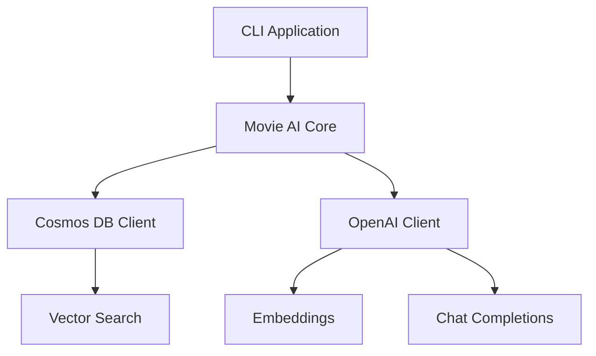

# TypeScript Cosmos DB Business Intelligence AI

🎓 **A Teaching Repository for Building AI-Powered Movie Search with Azure**

Learn how to build a complete TypeScript application that combines Azure Cosmos DB with OpenAI for intelligent movie search and recommendations.

## 🚀 Quick Start

1. **Prerequisites**: Azure subscription, Node.js 18+, TypeScript
2. **Setup**: `npm install && npm run setup`
3. **Deploy**: `npm run deploy`
4. **Run**: `npm start`

## 📚 Learning Path

This repository is organized for progressive learning:

### 📖 Documentation
- [`docs/README.md`](docs/README.md) - Detailed project overview
- [`docs/getting-started.md`](docs/getting-started.md) - Step-by-step setup guide  
- [`docs/architecture.md`](docs/architecture.md) - System design and patterns
- [`docs/lessons-learned.md`](docs/lessons-learned.md) - Critical implementation insights
- [`docs/troubleshooting.md`](docs/troubleshooting.md) - Common issues and solutions

### 🎓 Tutorials
- [`tutorials/01-setup/`](tutorials/01-setup/) - Environment and Azure resource setup
- [`tutorials/02-cosmos-db/`](tutorials/02-cosmos-db/) - Database operations and vector indexing
- [`tutorials/03-openai-integration/`](tutorials/03-openai-integration/) - AI/ML integration patterns
- [`tutorials/04-vector-search/`](tutorials/04-vector-search/) - Semantic search implementation
- [`tutorials/05-testing/`](tutorials/05-testing/) - Comprehensive testing strategies

### 📋 Examples
- [`examples/basic-queries/`](examples/basic-queries/) - Simple Cosmos DB queries
- [`examples/vector-search/`](examples/vector-search/) - Vector similarity search
- [`examples/ai-responses/`](examples/ai-responses/) - OpenAI integration patterns

## 🏗️ Architecture



## 🧪 Testing

- **Unit Tests**: `npm test`
- **Integration Tests**: `npm run test:integration`
- **E2E Tests**: `npm run test:e2e`
- **Coverage**: `npm run coverage`

## 🛠️ Key Technologies

- **TypeScript ESM** - Modern JavaScript with strong typing
- **Azure Cosmos DB** - NoSQL database with vector search
- **Azure OpenAI** - GPT-4o and text-embedding-ada-002
- **Vitest** - Fast and modern testing framework
- **Azure Developer CLI** - Infrastructure as code

## 📁 Project Structure

```
├── 📚 docs/              # All documentation
├── 🎓 tutorials/         # Step-by-step learning materials  
├── 📋 examples/          # Code examples for each feature
├── 📁 src/               # Source code (well-organized)
├── 🧪 tests/             # Comprehensive test suite
├── 🛠️ tools/             # Scripts and infrastructure
└── 📊 data/              # Sample data and schemas
```

## 🔧 Development Commands

```bash
# Setup and deployment
npm run setup              # Initial environment setup
npm run deploy             # Deploy Azure resources
npm run validate           # Validate configuration

# Development
npm run dev                # Start development mode
npm run build              # Build for production
npm run lint               # Code linting

# Testing
npm test                   # Run all tests
npm run test:unit          # Unit tests only
npm run test:integration   # Integration tests only
npm run coverage           # Generate coverage report
```

## 🎯 Learning Objectives

After completing this tutorial, you'll understand:

- ✅ Modern TypeScript ESM patterns and async/await best practices
- ✅ Azure Cosmos DB vector search and indexing strategies
- ✅ OpenAI API integration with proper error handling
- ✅ Semantic search implementation with fallback mechanisms
- ✅ Comprehensive testing strategies for Azure applications
- ✅ Infrastructure as code with Azure Developer CLI

## 🚨 Critical Configuration Notes

⚠️ **Common Pitfall**: Azure OpenAI baseURL construction
- ❌ Wrong: `https://account.openai.azure.com/`
- ✅ Correct: `https://account.openai.azure.com/openai/deployments/model-name`

📖 See [`docs/lessons-learned.md`](docs/lessons-learned.md) for comprehensive troubleshooting guidance.

## 📝 License

This project is licensed under the MIT License - see the LICENSE file for details.

---

💡 **Tip**: Start with [`docs/getting-started.md`](docs/getting-started.md) for a guided learning experience!
