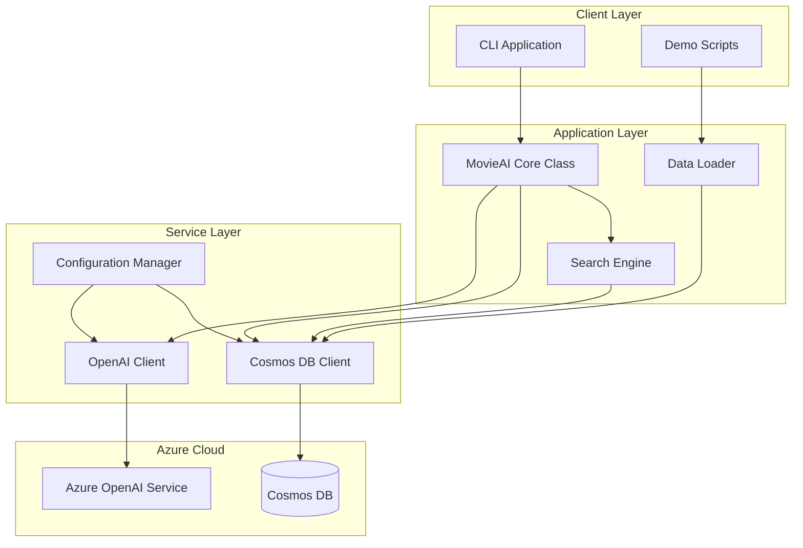
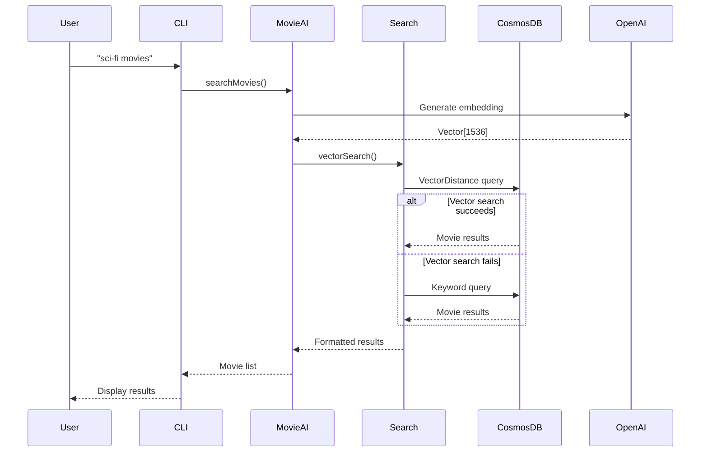
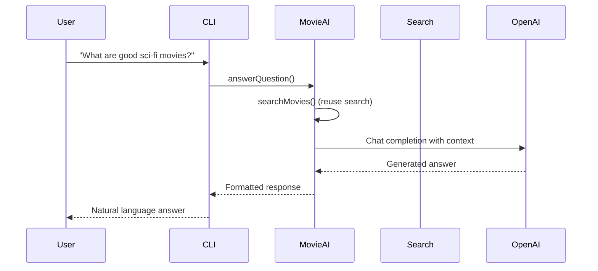

# System Architecture

This document outlines the architecture and design patterns used in the TypeScript Cosmos DB AI application.

## High-Level Architecture



## Core Components

### 1. MovieAI Core Class (`src/index.ts`)

The main orchestrator that coordinates between search and AI services:

```typescript
class MovieAI {
  private clients: Clients;
  
  async init(): Promise<void>           // Initialize all Azure clients
  async searchMovies(query: string)     // Perform vector + keyword search
  async answerQuestion(question: string) // Generate AI responses
}
```

**Key Patterns**:
- **Two-phase initialization**: Constructor + async `init()` method
- **Graceful degradation**: Falls back to keyword search if vector search fails
- **Error isolation**: Each method handles its own errors

### 2. Client Management (`src/utils/clients.ts`)

Centralized Azure service client creation and validation:

```typescript
export async function createClients(config?: Config): Promise<Clients>
```

**Key Features**:
- **Upfront validation**: All configuration validated before client creation
- **Optional config parameter**: Supports dependency injection for testing
- **Model validation**: Tests Azure OpenAI model availability with timeouts
- **Resource preparation**: Uses `createIfNotExists` for databases/containers

### 3. Search Engine (`src/utils/query.ts`)

Multi-layered search strategy with fallbacks:

```typescript
// 1. Vector search with VectorDistance function
// 2. Application-level vector similarity
// 3. Keyword-based fallback
```

**Search Flow**:
1. Generate embedding for query
2. Try Cosmos DB vector search
3. Fall back to manual similarity calculation
4. Final fallback to keyword search

### 4. Configuration Management (`src/utils/config.ts`)

Environment-based configuration with defaults:

```typescript
export const config = {
  cosmosDb: { endpoint, key, databaseId, containerId },
  openai: {
    llm: { endpoint, key, deploymentName, apiVersion },
    embedding: { endpoint, key, deploymentName, apiVersion }
  }
}
```

## Data Flow

### Movie Search Query Flow



### AI Question Answering Flow



## Design Patterns

### 1. Dependency Injection Pattern

```typescript
// Supports both global config and injected config
async function createClients(configParam?: Config): Promise<Clients> {
    const currentConfig = arguments.length > 0 ? configParam : config;
    // ...
}
```

**Benefits**:
- Testable (inject mock configs)
- Flexible (can override global config)
- Type-safe (TypeScript ensures correct structure)

### 2. Two-Phase Initialization Pattern

```typescript
class MovieAI {
    constructor() {
        // Synchronous setup only
    }
    
    async init(): Promise<void> {
        // All async operations here
        this.clients = await createClients();
    }
}
```

**Benefits**:
- Avoids async constructors (anti-pattern)
- Clear separation of sync/async setup
- Better error handling for initialization

### 3. Graceful Degradation Pattern

```typescript
async function searchMovies(query: string) {
    try {
        return await vectorSearch(query);
    } catch (vectorError) {
        console.warn('Vector search failed, falling back to keyword search');
        return await keywordSearch(query);
    }
}
```

**Benefits**:
- Application remains functional even if advanced features fail
- Progressive enhancement
- Better user experience

### 4. Promise.allSettled Pattern

```typescript
const validationResults = await Promise.allSettled([
    validateModelAvailability(llm, 'gpt-4o', 'llm'),
    validateModelAvailability(embedding, 'text-embedding-ada-002', 'embedding')
]);
```

**Benefits**:
- Don't fail client creation if one model is unavailable
- Collect all validation results
- Graceful handling of partial failures

## Testing Architecture

### Test Structure

```
tests/
├── unit/           # Fast, isolated tests
├── integration/    # Azure service tests  
└── e2e/           # Full workflow tests
```

### Mocking Strategy

1. **Unit Tests**: Mock all external dependencies
2. **Integration Tests**: Real Azure services, test data
3. **E2E Tests**: Full application stack

### Key Testing Patterns

- **Mock restoration**: Capture and restore original mocks
- **Async test handling**: Proper async/await in test setup
- **Type-safe mocks**: Use proper TypeScript mocking

## Error Handling Strategy

### Hierarchical Error Handling

1. **Function Level**: Specific error handling and logging
2. **Service Level**: Client-specific error handling
3. **Application Level**: Global error handling and user feedback

### Error Categories

- **Configuration Errors**: Missing or invalid environment variables
- **Network Errors**: Azure service connectivity issues
- **Validation Errors**: Invalid data or API responses
- **Business Logic Errors**: Application-specific failures

## Performance Considerations

### Caching Strategy

- **Client Reuse**: Create clients once, reuse across operations
- **Embedding Caching**: Store embeddings in Cosmos DB documents
- **Connection Pooling**: Let Azure SDKs handle connection management

### Rate Limiting

- **OpenAI API**: Batch operations and implement retry logic
- **Cosmos DB**: Use efficient queries and indexing
- **Concurrent Operations**: Use Promise.allSettled for parallel operations

## Security Patterns

### Configuration Security

- **Environment Variables**: Never commit secrets to source control
- **Key Rotation**: Support for updating keys without application restart
- **Principle of Least Privilege**: Use minimal required permissions

### API Security

- **API Key Management**: Secure storage and transmission
- **Request Validation**: Validate all inputs
- **Error Information**: Don't leak sensitive information in errors

This architecture supports scalability, maintainability, and provides a solid foundation for learning modern TypeScript and Azure development patterns.
